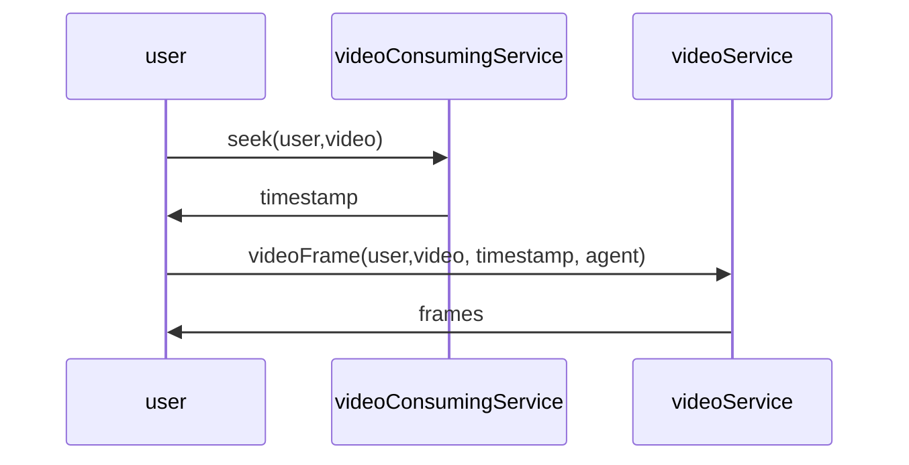

## Requirements
1. **Streaming video**
2. Processing video
3. Broadcasting
4. Failproof
5. Advertisements
6. Reactions
7. Disclaimers/News Flashes
8. Graceful degradation of video quality at low bandwidths
9. Multiple device support
10. buffering, loading videos when paused

## High Level Design
### Network Protocols
- [[WebRTC]] or [[MPEG-DASH]] for video transmission to users. 
	- broadcast
	- fetch couple of frames at a time
- [[RTMP]] for video storage at source 
	- no data loss
- [[REST]] for other APIs (comments, likes, etc)

### Storage
- [[File Systems]] for video storage
- [[Relational Databases]] for other data. Comments may be stored in [[NoSQL]] databases - since we are looking for scale for a complex data structure - fetch all comments, fetch replies etc.. transactional nature is not important.
- consider using [[computer science/software design/network/CDN]]s for video broadcasts
	- Netflix’s solution: [[computer science/software design/network/CDN]]s work with ISPs to cache recent data, and use the delivery network to deliver the content through servers worldwide  
### Data Pipeline
The raw source (4k) video needs to be transformed on the fly to different resolutions and formats in order to support different devices and bandwidths

- **Resolutions** → 4k, 1080p, 720p, 480p …
- **Compression** → H.264, H.265 etc for storage efficiency
- **Formats** → mp4, .mov, etc for different devices

> **Resolutions * Compression/Formats**  combinations to be processed

- Split the video into several bits(consisting of **n** frames or secs)
- send it to parallel servers that perform the required compressions or transformations
	- instead of having separate servers for each combination type, its better to have all servers be able to handle all combinations and then use [[Load Balancing]] on them.
- [[Map-Reduce]] paradigm

- alternatively can split into scenes - can categorize videos as engaging or non-engaging
	- if engaging: user will likely skip to a particular scene.. so we can break the video into scenes and preload the engaging scenes at the beginning of the video
	- if non-engaging, user may not skip or may skip to random points- so break the video into uniform chunks with no preloading.
## Low level design

### Use case diagram
![[live streaming app use case diagram.canvas|live streaming app use case diagram]]

### Class diagram
![[live streaming class diagram]]

### Sequence Diagram

